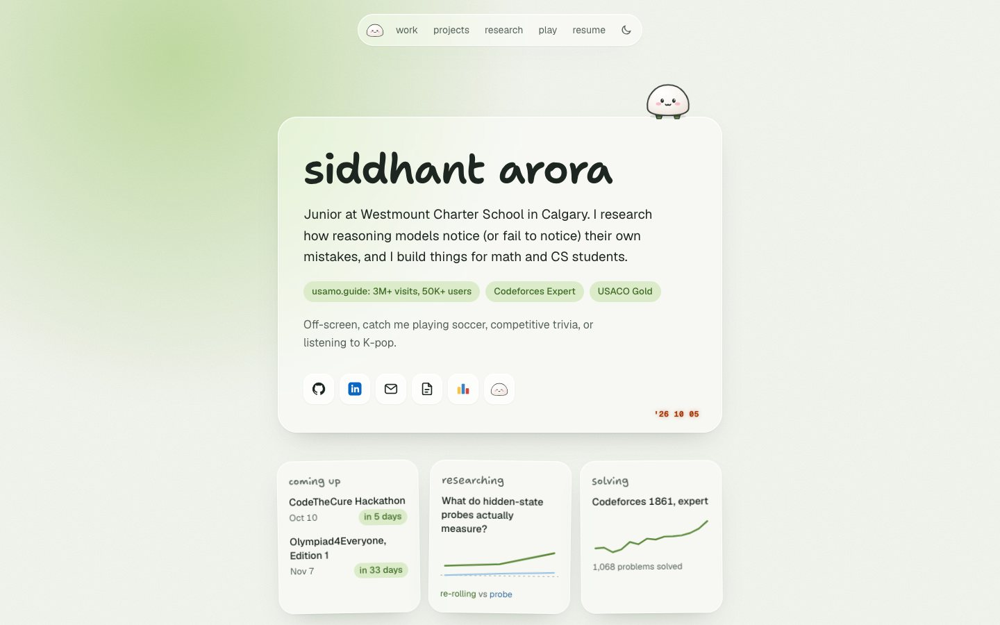

# Siddhant Arora: portfolio

A portfolio site listing some cool stuff about me :). Made for personal use and Hack Club Horizons.

Frosted glass over a single matcha glow, a mochi with a tiny jetpack that follows you down the page, live Codeforces and GitHub stats, and a small game at the bottom.



## Motivation

It's 2026, and a portfolio that is both clear and memorable is one of the best ways to show who you are. This one is built to read in about 20 seconds (research, work, projects, and highlights up front) and still be fun to poke at. Enjoy!

## Stack

- Next.js 16 (App Router) + React 19 + TypeScript
- Tailwind CSS 4, with all colour tokens in `app/globals.css`
- Geist for text, a self-hosted subset of Shantell Sans for headings and handwriting
- No animation or UI libraries: motion is CSS plus a little `requestAnimationFrame`, and charts are server-rendered SVG

Runtime dependencies are just `next`, `react`, and `react-dom`.

```bash
npm install
npm run dev                  # http://localhost:3000
npm run build                # production build
npm run typecheck
npm run codeforces:snapshot  # refresh the Codeforces fallback
npm run github:snapshot      # refresh the GitHub fallback
```

## Content

All content lives in typed files under `data/`:

| File | What's in it |
| --- | --- |
| `data/site.ts` | intro, links, research (with the chart's data), work (each gets a page at `/work/<slug>`), the compact "also" list, upcoming events, highlights |
| `data/projects.ts` | projects; each gets a page at `/projects/<slug>` |
| `data/*-snapshot.json` | fallback Codeforces and GitHub stats if an API is down |

Images live in `public/work/<slug>/` and `public/projects/<slug>/`; logos in `public/logos/`. Anything unconfirmed can be written as `TODO("what's missing")`: it shows as a dashed note in dev and preview deploys and is hidden in production.

## How it works

- `app/layout.tsx` sets up fonts, the theme (light by default, restored before paint), the nav, the background, mochi, the ask-mochi helper, and the easter eggs.
- `app/page.tsx` renders the home page. It revalidates daily, which refreshes the Codeforces stats (`lib/codeforces.ts`, rate-limited to one call per ~2 s), the GitHub stats (`lib/github.ts`), and the event countdowns.
- `app/work/[slug]`, `app/projects/[slug]`, and `app/research/[slug]` are the detail pages; each has its own OG image.
- `components/mochi/` holds the mascot: the drawing, the companion's physics, the scripted ask-mochi helper, and the easter eggs. `components/game/` is the jetpack game, loaded only when someone presses Play.

## Secrets

Type `mochi` or `matcha` anywhere, try the Konami code, click the orange date stamp, poke or throw mochi, and play the game at the bottom of the page.

## Deploy

Vercel, Next.js preset, no required env vars. Optional:

- `NEXT_PUBLIC_SITE_URL`: the custom domain, used for canonical URLs, OG images, and the sitemap.
- `GITHUB_TOKEN`: raises the GitHub API rate limit for the stats card.

To run a production build next to `next dev` without sharing `.next`, use `NEXT_DIST_DIR=.next-qa npm run build`.

## Design notes

- `PRODUCT.md`: who the site is for, and the facts it's allowed to claim.
- `DESIGN.md`: the design system (tokens, type, motion, mochi, components).
- `assets/fonts/README.md`: how the Shantell Sans subset was built.
- `github-profile/`: a matching GitHub profile README.

## Attribution

All content was written by hand. Claude Code was used to help design and build the frontend.
